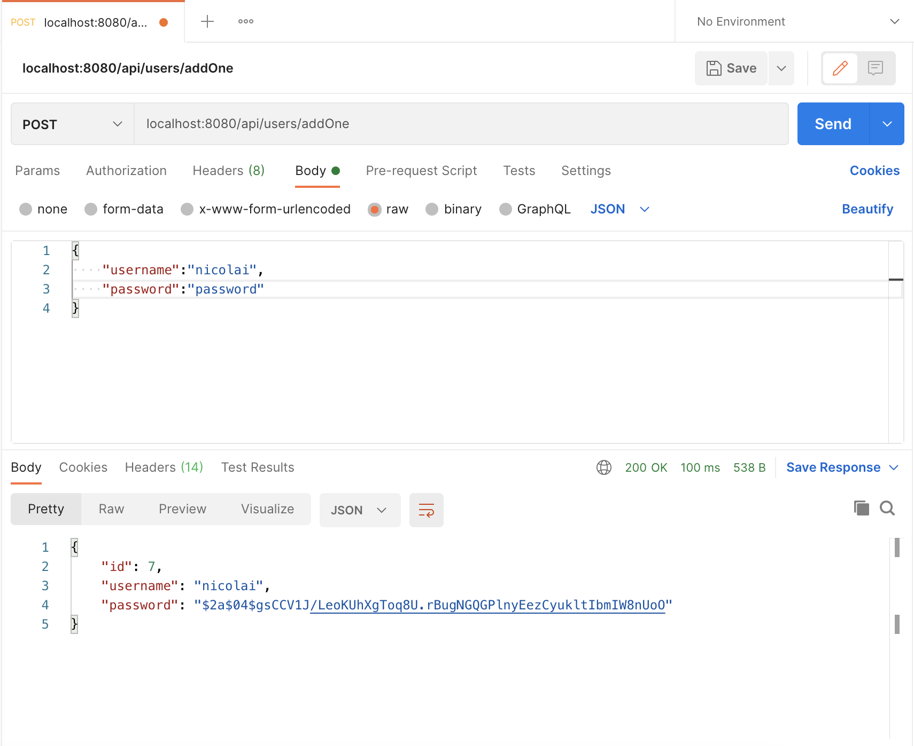
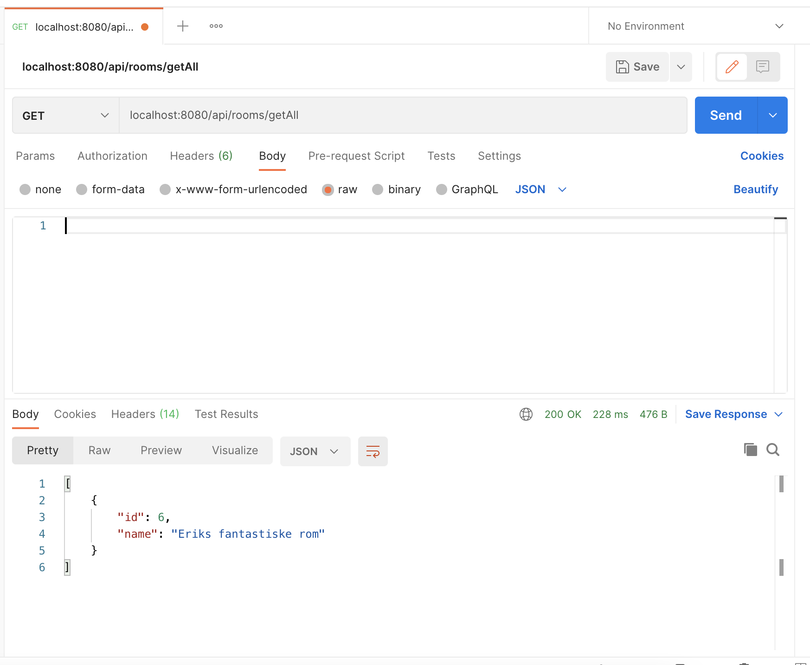
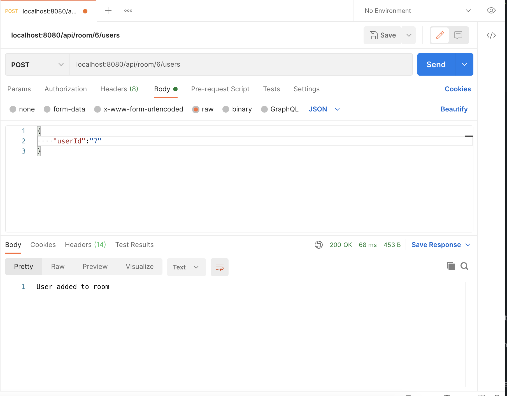

#Oblig 2
___
####Nicolai Molstad, Emilie Martin og Erik Myhre

## Implementing task 1
___
We started with implenting the API. Where we add all the routes for:
- Users
- Chat-rooms
- Room users
- Messages

As an example we will show one of them, as they are quite similar.

@RequestMapping is routing all calls for api/users to this controller. 
@AutoWired is dependency injecting the service for the user table in the database.
@PostMapping is defines an endpoint for putting data into the API.
@GetMapping is defining an endpoint for getting the data from the API.

We of course also had to have the files from the folder model, service and repository as well.
In model we have just made the objects:
- Message
- Room
- RoomUser
- RoomUserId
- User

Again for the example I will only show a picture of UserService. 

@Transactional guarantees serializing of the database. 

For the Repository.

This is the connection to the database. The JPARepository interface has predefined methods for connecting to the database.

## Implementing Task 2
___

We implemented the "client program" via the *oblig 2* folder.
The *oblig 2* folder contains the entirety of the frontend part of the project.

To implement this part we used ReactJS. The entry point for the application is App.js.
We have made the components for the
- Frontpage
- Login
- Register
- Rooms
- Room/Id

The site has the basic functions you would excpect from the names of the components.

We then moved on to the bots. ClientBot and WordAnalysing are the files we made to implement this.
WordAnalysing is heavily inspired from portfolio 1 and thus makes the bots just a simple replybot.
In Clientbot we have made 4 bots with different names and using the WordAnalysing to each create their own unique replies.

## Implementing task 3
___

To do this we figured we needed websockets. 

The chatting room connects to the websocket. The room subscribes to the /topic/public.
For each time the user sends their message; it sends the room number to the websocket. 
All users in the same room then fetches the messages from the API. 

## Running
___

Running the program requires the dependencies in the pom.xml file. 
Maven uses these files to run and build the program.

The dependencies used in backend are:
* Springboot (server)
* Lombok (making constructors and getters and setters)
* h2database (database)
* bcrypt (hashing the password)

The dependencies used in frontend are:
* StompJS (connecting to the websocket)
* SockJS-Client (connecting to websocket)
* React-router-dom (redirecting)

To build and run the project we are using maven to create a .jar.
The command we are using is mvn clean install. Java runs the .jar with the command java -jar *.jar.
You will need to have maven installed to do this.
We have premade the .jar file. We have made the docker file to make an image, and in the start.sh script you can automatically buid the image and run a container based on that image

## Outputs
___

#### Outputs from browsers

#### Outputs from console

#### Outputs from API

## Other stuff
___

After we implemented all the most important features we added some quality of life improvements to the look and use of the site using CSS and javascript.
An example of this would be being able to just click enter from having written your password to automatically click the login/register button.
